虚拟机的过程（略），参考：https://blog.csdn.net/weixin_44813579/article/details/105867198?spm=1001.2101.3001.6650.3&utm_medium=distribute.pc_relevant.none-task-blog-2%7Edefault%7ECTRLIST%7Edefault-3.fixedcolumn&depth_1-utm_source=distribute.pc_relevant.none-task-blog-2%7Edefault%7ECTRLIST%7Edefault-3.fixedcolumn


因为在安装过程中需要创建用户，所以无需输入相应命令。

# 安装一些必要的工具

`sudo su`切换到`root`模式

```shell
1、更新apt-get
	切换源，参考：https://blog.csdn.net/yscoder/article/details/110681828
	sudo apt-get update

	说明：apt-get是用来安装软件的工具
2、安装ssh服务
	apt-get install openssh-server
	说明： ssh是机器之间远程登录的服务
3、安装vim 
	apt-get install vim
```

# 配置免密登录

## 禁用防火墙

```SHELL
ufw disable 

ufw status //查看防火墙状态
```


## 生成密钥对

在用户模式下进行：

```shell
ssh localhost（**测试一下 SSH 是否可用**）

exit

cd ~/.ssh

ssh-keygen -t rsa
```


说明：一路回车，在~/.ssh目录会生成一个两个文件，id_rsa和id_rsa.pub


## 将公钥复制到localhost

```shell
ssh-copy-id localhost
```


# 在Ubuntu中挂载共享文件夹

参考：https://www.pianshen.com/article/27431804257/

1. “设备”->“共享文件夹”，记住共享文件夹的共享名

   F:/XXX/Share 共享文件夹名：Share

   选择

2. “设备”->“安装增强功能“

   直接使用sf_Share

3. 设置vbox共享粘贴板

   “设备”->“共享粘贴板”->“双向“

   说明：这样在真机和虚拟机之间可以任意的复制和粘贴。


# 安装并配置jdk

## 下载安装

```shell
mkdir  ~/app
chmod -R 777 ~/app
tar -zxvf /media/sf_Share/jdk-8u311-linux-x64.tar.gz -C ~/app
mv ~/app/jdk1.8.0_311 ~/app/jdk
```


## 配置环境变量

```SHELL
gedit ~/.bashrc
export JAVA_HOME=/home/marui/app/jdk
export JRE_HOME=$JAVA_HOME/jre
export CLASSPATH=.:$CLASSPATH:$JAVA_HOME/lib:$JRE_HOME/lib
export PATH=$PATH:$JAVA_HOME/bin:$JRE_HOME/bin

source ~/.bashrc
java -version
```

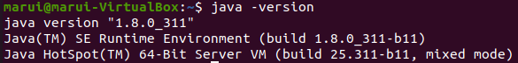


# 安装并配置Hadoop

## 下载安装

```shell
tar -zxvf /media/sf_Share/hadoop-2.10.1.tar.gz -C ~/app
mv ~/app/hadoop-2.10.1 ~/app/hadoop
```


## 配置环境变量

```SHELL
gedit ~/.bashrc
export JAVA_HOME=/home/marui/app/jdk
export JRE_HOME=$JAVA_HOME/jre
export CLASSPATH=.:$CLASSPATH:$JAVA_HOME/lib:$JRE_HOME/lib
export HADOOP_HOME=/home/marui/app/hadoop
export PATH=$PATH:$JAVA_HOME/bin:$JRE_HOME/bin:$HADOOP_HOME/bin:$HADOOP_HOME/sbin

source ~/.bashrc
```


## 配置hadoop-env.sh

```SHELL
gedit ~/app/hadoop/etc/hadoop/hadoop-env.sh

找到export JAVA_HOME=${JAVA_HOME}这一行，将其修改为：
export JAVA_HOME=/home/marui/app/jdk
```


## 配置core-site.xml

```XML
gedit ~/app/hadoop/etc/hadoop/core-site.xml

<configuration>
    <!--hdfs文件系统的主机和端口号  --> 
  <property>
    <name>fs.defaultFS</name>
    <value>hdfs://localhost:9000</value>
  </property>      
  <property>
    <name>hadoop.tmp.dir</name>name>
<value>/home/marui/app/hadoop/tmp</value><!--该目录需要手动创建， hadoop文件系统依赖的基本配置 --> 
  </property>
</configuration>
```


## 配置hdfs-site.xml

```XML
gedit ~/app/hadoop/etc/hadoop/hdfs-site.xml

<configuration>
  <property><!--配置块(上传文件)的副本数 -->
　  <name>dfs.replication</name>
　　<value>1</value>
　</property>
</configuration>
```


## 配置mapred-site.xml

```XML
需将先把mapred-site.xml.template复制成mapred-site.xml
gedit ~/app/hadoop/etc/hadoop/mapred-site.xml

<configuration>
  <property><!--mapreduce框架设置 -->
　  <name>mapreduce.framework.name</name>
　　<value>yarn</value>
　</property>
</configuration>
```


## 配置yarn-site.xml

```xml
gedit ~/app/hadoop/etc/hadoop/yarn-site.xml

<configuration>
<!-- Site specific YARN configuration properties 
NodeManager 上运行的附属服务。 需配置成 mapreduce_shuffle, 才可运行 MapReduce 程序
-->
  <property>
　  <name>yarn.nodemanager.aux-services</name>
　  <value>mapreduce_shuffle</value>
　</property>
</configuration>
```


注意：默认只有一个reducer

# 运行hadoop

## 格式化namenode

```shell
cd ~/app/hadoop/bin
./hadoop namenode -format
说明：首次运行须格式化，以后运行就不需要这一步。格式化后会在core-site.xml中hadoop.tmp.dir所指定的目录中生成name文件夹。

```

## 运行hadoop (要在用户模式下)

```shell
cd ~/app/hadoop/sbin
./start-all.sh
```


## 查看进程

```shell
jps

6208 NodeManager
7122 Jps
5204 NameNode
6086 ResourceManager
5337 DataNode
5963 SecondaryNameNode
```

## webUI查看

http://localhost:50070，查看hdfs

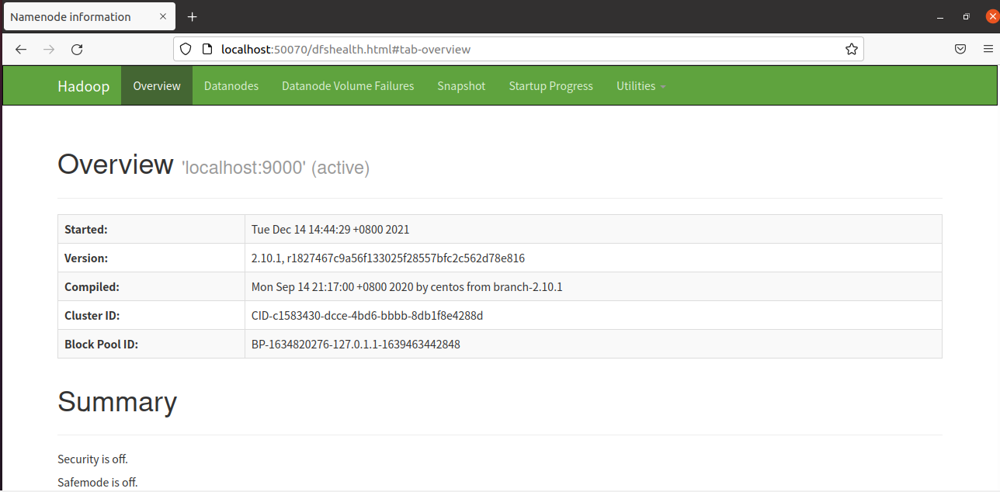

http://localhost:8088，查看mapreduce作业情况

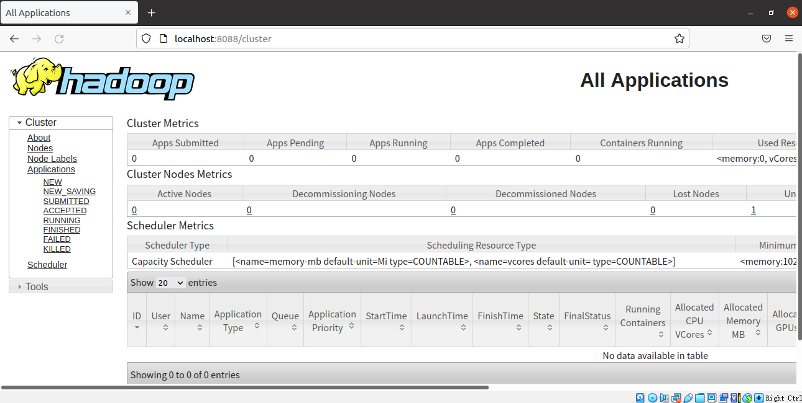


# 测试wordcount程序

## 生成单词文件

```shell
mkdir ~/words
echo 'hello world hello hadoop' > ~/words/word1.txt 
echo 'have run on hadoop' > ~/words/word2.txt
```

## 上传至hdfs

```shell
hdfs dfs -mkdir /input # 在hdfs上新建输入数据的目录
hdfs dfs -put  ~/words/word*.txt  /input # 上传文件
```


## 运行hadoop自带的单词计数程序

```shell
hadoop jar ~/app/hadoop/share/hadoop/mapreduce/hadoop-mapreduce-examples-2.10.1.jar wordcount /input output
```

一直卡在: `INFO mapreduce.Job: Running job`

解决方案：参考https://blog.csdn.net/dai451954706/article/details/50464036?spm=1001.2101.3001.6650.6&utm_medium=distribute.pc_relevant.none-task-blog-2%7Edefault%7EBlogCommendFromBaidu%7Edefault-6.highlightwordscore&depth_1-utm_source=distribute.pc_relevant.none-task-blog-2%7Edefault%7EBlogCommendFromBaidu%7Edefault-6.highlightwordscore

把`mapred-site.xml`的配置注释掉，运行

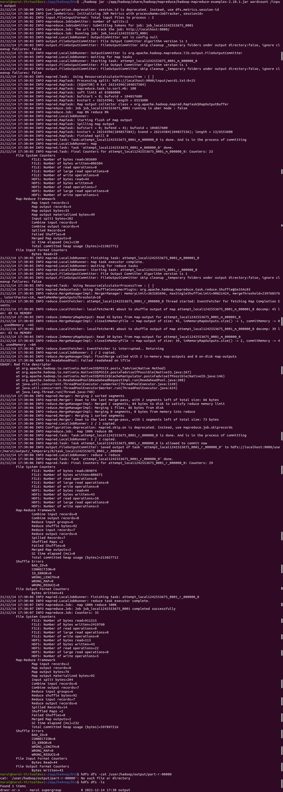


## 查看结果

```shell
hdfs dfs -cat  output/part-r-00000
```

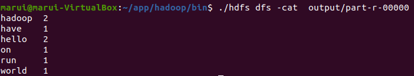

也可以在http://localhost:50070/的`utilities`的`Browse the file system`中查看结果


# 矩阵相乘

乘积C的第m行第n列的元素等于矩阵A的第m行的元素与矩阵B的第n列对应元素乘积之和。

参考：https://blog.csdn.net/XX_123_1_RJ/article/details/44753677?spm=1001.2101.3001.6650.8&utm_medium=distribute.pc_relevant.none-task-blog-2%7Edefault%7ECTRLIST%7Edefault-8.no_search_link&depth_1-utm_source=distribute.pc_relevant.none-task-blog-2%7Edefault%7ECTRLIST%7Edefault-8.no_search_link

我的理解：

Map阶段：B的某列 n 的元素，必定要与A的某行 m 相乘，同样的，A的某行 m 的元素必定要与B的某列 n 相乘，所以key值是（m，n），对应Cmn。value值是 i 和Bin（i是B的行），以及 j 和 Amj（j是A的列）

Reduce阶段：key值（m，n）对应着A的行某个向量，对应B的某个列向量，做点积即可（A中第j列的元素必须和B中第j行的元素相乘）

## 生成矩阵文件

```python
import random


class BuildMatrix(object):

    def build_matrix_a(self, row, col):
        fd = open('matrix_a.txt', 'a')  # 'a' is to write the file at the end of old file
        num = ''
        col -= 1
        for i in range(row):
            for j in range(col):
                num += str(random.randint(1, 100)) + ','
            num += str(random.randint(1, 100))
            fd.write(num + '\n')
            num = ''
        fd.close()

    def build_matrix_b(self, row, col):

        fd = open('matrix_b.txt', 'a')
        num = ''
        col -= 1
        for i in range(row):
            for j in range(col):
                num += str(random.randint(1, 100)) + ','
            num += str(random.randint(1, 100))
            fd.write(num + '\n')
            num = ''
        fd.close()


if __name__ == '__main__':
    rowA = 31
    colA = 18
    rowB = 18
    colB = 21
    bulid = BuildMatrix()
    bulid.build_matrix_a(rowA, colA)
    bulid.build_matrix_b(rowB, colB)


```

在本地利用python生成`matrix_a.txt`和`matrix_b.txt`，上传至共享文件夹，再移动到`~/matrixs`

## 上传至hdfs

```shell
hdfs dfs -mkdir /input1 
hdfs dfs -put  ~/matrixs/matrix_*.txt  /input1
```


## 实现矩阵相乘程序

```JAVA
import java.io.IOException;
import java.util.HashMap;
import java.util.Iterator;
import java.util.Map;

import org.apache.hadoop.conf.Configuration;
import org.apache.hadoop.fs.Path;
import org.apache.hadoop.io.IntWritable;
import org.apache.hadoop.io.LongWritable;
import org.apache.hadoop.io.Text;
import org.apache.hadoop.mapreduce.Job;
import org.apache.hadoop.mapreduce.Mapper;
import org.apache.hadoop.mapreduce.Reducer;
import org.apache.hadoop.mapreduce.lib.input.FileInputFormat;
import org.apache.hadoop.mapreduce.lib.input.FileSplit;
import org.apache.hadoop.mapreduce.lib.input.TextInputFormat;
import org.apache.hadoop.mapreduce.lib.output.FileOutputFormat;
import org.apache.hadoop.mapreduce.lib.output.TextOutputFormat;

public class MatrixMultiply {
    
    public static class MatrixMapper extends
            Mapper<LongWritable, Text, Text, Text> {
        private String flag = null;// 数据集名称
        private int rowNum = 31;// 矩阵A的行数
        private int colNum = 21;// 矩阵B的列数
        private int rowIndexA = 1; // 矩阵A，当前在第几行
        private int rowIndexB = 1; // 矩阵B，当前在第几行

        @Override
        protected void setup(Context context) throws IOException,
                InterruptedException {
            flag = ((FileSplit) context.getInputSplit()).getPath().getName();// 获取文件名称
        }

        @Override
        protected void map(LongWritable key, Text value, Context context)
                throws IOException, InterruptedException {
            String[] tokens = value.toString().split(",");
            if ("matrix_a.txt".equals(flag)) {
                for (int i = 1; i <= colNum; i++) {
                    Text k = new Text(rowIndexA + "," + i); // 将 A 矩阵的行列值写入 key 中
                    for (int j = 0; j < tokens.length; j++) {
                        int temp = Integer.parseInt(tokens[j]) + 1;
                        Text v = new Text("a," + (j + 1) + "," + String.valueOf(temp));
                        context.write(k, v);
                    }
                }
                rowIndexA++;// 每执行一次map方法，矩阵向下移动一行
            } else if ("matrix_b.txt".equals(flag)) {
                for (int i = 1; i <= rowNum; i++) {
                    for (int j = 0; j < tokens.length; j++) {
                        Text k = new Text(i + "," + (j + 1));
                        int temp = Integer.parseInt(tokens[j]) + 1;
                        Text v = new Text("b," + rowIndexB + "," + String.valueOf(temp));
                        context.write(k, v);
                    }
                }
                rowIndexB++;// 每执行一次map方法，矩阵向下移动一行
            }
        }
    }

    // Reduce.
    public static class MatrixReducer extends Reducer<Text, Text, Text, IntWritable> {
        @Override
        protected void reduce(Text key, Iterable<Text> values, Context context) throws IOException, InterruptedException {
            Map<String, String> mapA = new HashMap<String, String>();
            Map<String, String> mapB = new HashMap<String, String>();

            for (Text value : values) {
                String[] val = value.toString().split(",");
                if ("a".equals(val[0])) {
                    mapA.put(val[1], val[2]);
                } else if ("b".equals(val[0])) {
                    mapB.put(val[1], val[2]);
                }
            }

            int result = 0;
            Iterator<String> mKeys = mapA.keySet().iterator();
            while (mKeys.hasNext()) {
                String mkey = mKeys.next();
                if (mapB.get(mkey) == null) {// 因为 mkey 取的是 mapA 的 key 集合，所以只需要判断 mapB 是否存在即可。
                    continue;
                }
                result += Integer.parseInt(mapA.get(mkey))
                        * Integer.parseInt(mapB.get(mkey));
            }
            context.write(key, new IntWritable(result));
        }
    }

    // Main function.
    public static void main(String[] args) throws IOException,
            ClassNotFoundException, InterruptedException {

        Configuration conf = new Configuration();
        Job job = Job.getInstance(conf, "Matrix Multiply");
        job.setJarByClass(MatrixMultiply.class);

        job.setOutputKeyClass(Text.class);
        job.setOutputValueClass(Text.class);

        job.setMapperClass(MatrixMapper.class);
        job.setReducerClass(MatrixReducer.class);

        job.setInputFormatClass(TextInputFormat.class);
        job.setOutputFormatClass(TextOutputFormat.class);

        FileInputFormat.setInputPaths(job, new Path(args[0]));
        Path outputPath = new Path(args[1]);
        outputPath.getFileSystem(conf).delete(outputPath, true);
        FileOutputFormat.setOutputPath(job, outputPath);

        System.exit(job.waitForCompletion(true) ? 0 : 1);


    }
}
```

打包成`Hadoop.jar`，改名为`MatrixMultiply.jar`

## 运行矩阵相乘程序

```shell
hadoop jar ~/app/hadoop/share/hadoop/MatrixMultiply.jar MatrixMultiply /input1/* output1
```

报错：`[Resources are low on NN. Please add or free up more resources then turn off safe mode manually.](https://www.cnblogs.com/itboys/p/6021838.html)`

发现可能是因为磁盘空间不太够用，于是扩充磁盘，参考：

https://blog.csdn.net/weixin_41607151/article/details/82785998

https://www.cnblogs.com/cxl-blog/p/11459487.html

再次运行，成功

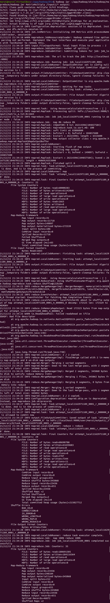

## 查看结果

```shell
hdfs dfs -cat output1/part-r-00000
```

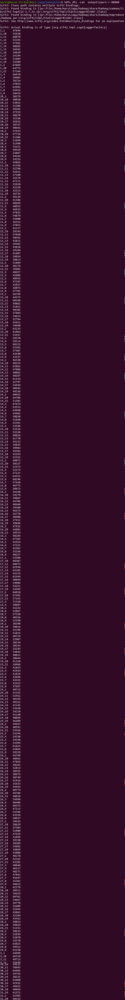


## 检测结果正确性

```python
# -*- coding: utf-8 -*-
import numpy as np


def readFile(path):
    # 打开文件（注意路径）
    f = open(path)
    # 逐行进行处理
    first_ele = True
    for data in f.readlines():
        #  去掉每行的换行符，"\n"
        data = data.strip('\n')
        #  按照 空格进行分割。
        nums = data.split(",")
        #  添加到 matrix 中。
        if first_ele:
            #  将字符串转化为整型数据
            nums = [int(x) for x in nums]
            #  加入到 matrix 中 。
            matrix = np.array(nums)
            first_ele = False
        else:
            nums = [int(x) for x in nums]
            matrix = np.c_[matrix, nums]
    f.close()
    return matrix.transpose()


# test.
if __name__ == '__main__':
    matrix_a = readFile("matrix_a.txt")
    matrix_b = readFile("matrix_b.txt")

    matrix_c = matrix_a.dot(matrix_b)
    print(matrix_c[0][0])
```

挑选几个数据进行验证，程序结果正确


# Dijkstra

## 生成有向图

```
A	0_B:10,C:5
B	-1_C:2,D:1
C	-1_B:3,D:9,E:2
D	-1_E:4
E	-1_D:6,A:7
```

其中，0代表是起点，-1代表目前起点到各点的最小距离；B：10，代表A到B点的距离是10

生成`graph.txt`，上传至共享文件夹，再移动到`~/graphs`

## 上传至hdfs

```shell
hdfs dfs -mkdir /input2
hdfs dfs -put  ~/graphs/*.txt  /input2
```

## 实现Dijkstra

参考：https://blog.csdn.net/cai13160674275/article/details/54427084?utm_medium=distribute.pc_relevant.none-task-blog-2~default~baidujs_baidulandingword~default-2&spm=1001.2101.3001.4242.1

Map：找到每个顶点到其他顶点的距离

Reduce：找到每个顶点到其他顶点的最短距离

然后一直运行这个过程，直到一轮mapreduce之后所有节点都没有更新，则停止

```java
import org.apache.commons.io.FileUtils;
import org.apache.hadoop.conf.Configuration;
import org.apache.hadoop.fs.Path;
import org.apache.hadoop.io.Text;
import org.apache.hadoop.mapreduce.Job;
import org.apache.hadoop.mapreduce.Mapper;
import org.apache.hadoop.mapreduce.Reducer;
import org.apache.hadoop.mapreduce.lib.input.FileInputFormat;
import org.apache.hadoop.mapreduce.lib.input.TextInputFormat;
import org.apache.hadoop.mapreduce.lib.output.FileOutputFormat;
import org.apache.hadoop.mapreduce.lib.output.TextOutputFormat;

import java.io.File;
import java.io.IOException;

public class Dijkstra {

    public static class DijkstraMapper extends Mapper<Object, Text, Text, Text> {
        public void map(Object key, Text value, Context context) throws IOException, InterruptedException {
            // A	0_B:4,C:2,D:5
            String[] split = value.toString().split("_");// A   0 and B:4,C:2,D:5

            String[] node = split[0].split("\t"); //A 0
            String nId = node[0];// A
            int cost = Integer.parseInt(node[1]); // 0

            String[] costAndNodes = split[1].split(","); // B:4 C:2 D:5

            if (cost != -1) {
                for (String s : costAndNodes) {
                    if (!s.equals(" ")) {
                        String[] costAndNode = s.split(":"); // B 4
                        String v_node = costAndNode[0];// B
                        int v_cost = Integer.parseInt(costAndNode[1]); // 4

                        context.write(new Text(v_node), new Text(v_cost + cost + "_" + " "));
                        // <B, newCost_ >
                    }
                }
            }

            context.write(new Text(nId), new Text(cost + "_" + split[1]));// <A, (0_B:4,C:2,D:5)>
        }
    }

    public static class DijkstraReducer extends Reducer<Text, Text, Text, Text> {
        public void reduce(Text key, Iterable<Text> values, Context context) throws IOException, InterruptedException {
            int lowCost = -1;
            String s_costAndNodes = " ";

            for (Text value : values) {
                // newCost_ or newCost_B:4,C:2,D:5
                String[] parts = value.toString().split("_");// newCost 空格 | newCost and B:4,C:2,D:5
                int cost = Integer.parseInt(parts[0]); // newCost
                String costAndNodes = parts[1];// 空格 or B:4,C:2,D:5

                if (cost != -1) // 如果cost不是-1
                {
                    if (lowCost == -1) {
                        lowCost = cost;
                    }
                    else {
                        if (cost < lowCost) {
                            lowCost = cost;
                        }
                    }
                }

                if (!costAndNodes.equals(" ")) {
                    s_costAndNodes = costAndNodes;
                }
            }
            context.write(key, new Text(lowCost + "_" + s_costAndNodes));// <A, (newCost_B:4,C:2,D:5)>
        }
    }

    public static void main(String[] args) throws Exception {
        Configuration conf = new Configuration();
        String out = "/part-r-00000";

        int i = 0;
        while (true) {
            i++;
            Job job = Job.getInstance(conf, "Dijkstra");
            job.setJarByClass(Dijkstra.class);
            job.setJobName("MapReduce" + i);

            job.setMapperClass(DijkstraMapper.class);
            job.setReducerClass(DijkstraReducer.class);

            job.setOutputKeyClass(Text.class);
            job.setOutputValueClass(Text.class);

            job.setMapOutputKeyClass(Text.class);
            job.setMapOutputValueClass(Text.class);

            if(i == 1) { FileInputFormat.addInputPath(job, new Path(args[0])); }
            else { FileInputFormat.addInputPath(job, new Path(args[1] + (i - 1) + out)); }

            FileOutputFormat.setOutputPath(job, new Path(args[1] + i));

            if(!job.waitForCompletion(true)) { System.exit(1); }

            if(i != 1){
                File anterior = new File(args[1] + (i - 1) + out);
                File actual = new File(args[1] + i + out);
                if(FileUtils.contentEquals(anterior, actual)) { break; }
            }

        }

        System.exit(0);
    }

}

```


## 运行Dijkstra

```SHELL
hadoop jar ~/app/hadoop/share/hadoop/Dijkstra.jar Dijkstra /input2/* output2
```

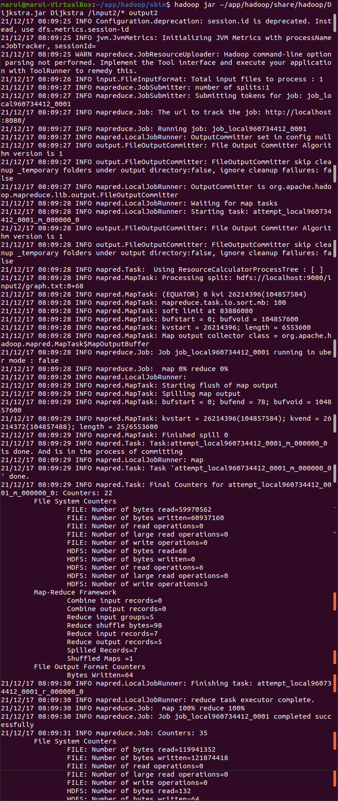

## 查看结果

### 查看输出文件夹

```SHELL
hdfs dfs -ls
```

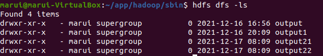

### 查看最后一个输出文件

```shell
hdfs dfs -cat output22/part-r-00000
```


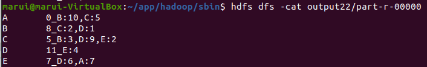

结果正确

# 二次排序

## 生成待排数据

```python
import random

class BuildSort(object):

    def build_sort(self, row, col, i):
        fd = open('sort_' + str(i) + '.txt', 'x')  # 'a' is to write the file at the end of old file
        num = ''
        col -= 1
        for i in range(row):
            for j in range(col):
                num += str(random.randint(1, 100)) + '\t'
            num += str(random.randint(1, 100))
            fd.write(num + '\n')
            num = ''
        fd.close()

if __name__ == '__main__':
    row = 31
    col = 2
    bulid = BuildSort()
    bulid.build_sort(row, col, 1)
    bulid.build_sort(row, col, 2)
    bulid.build_sort(row, col, 3)

```

生成`sort_1.txt sort_2.txt sort_3.txt`，上传至共享文件夹，再移动到`~/sorts`

## 上传至hdfs

```shell
hdfs dfs -mkdir /input3
hdfs dfs -put  ~/sorts/*.txt  /input3
```

## 实现二次排序程序

对第一列数据进行升序排序，若第一列相等，则按第二列进行降序排序

参考：https://blog.csdn.net/yancychas/article/details/84063889

https://www.linuxidc.com/Linux/2013-08/88603.htm

https://blog.csdn.net/m0_37065162/article/details/80881520

https://blog.csdn.net/kuodannie1668/article/details/82218205

https://blog.csdn.net/u010670689/article/details/80092275

书P209的编程过程图

1. Map起始阶段：<第一列，第二列>

2. Map结束阶段：

   对上述结果进行分区（按reducer的工作量进行分区）；每个分区内又调用`job.setSortComparatorClass()`设置的key比较函数类排序

   分区的作用：当数据key的值过于相似且集中时，大部分的数据就会分到同一个reducer中，从而造成数据倾斜，影响程序的运行效率。所以需要我们自己定制分区来根据自己的要求选择记录的reducer。

4. Reduce阶段：

   再次调用`job.setSortComparatorClass()`设置的key比较函数类对所有数据对排序（因为一个reducer接受多个mappers，需要重新排序）；将同一分区中的具有相同key值的记录分组

   reduce方法每次是读一条记录，处理完后还会判断下一条记录是不是和当前的key是不是同一个组，如果是的话，会继续读取这些记录的值，而这个记录也会被认为已经处理了，直到记录不是当前组，这次reduce调用才结束，这样一次reduce调用就会处理掉一个组中的所有记录，而不仅仅是一条了。


```java
import org.apache.hadoop.conf.Configuration;
import org.apache.hadoop.fs.Path;
import org.apache.hadoop.io.NullWritable;
import org.apache.hadoop.io.Text;
import org.apache.hadoop.io.WritableComparable;
import org.apache.hadoop.io.WritableComparator;
import org.apache.hadoop.mapreduce.Job;
import org.apache.hadoop.mapreduce.Mapper;
import org.apache.hadoop.mapreduce.Reducer;
import org.apache.hadoop.mapreduce.lib.input.FileInputFormat;
import org.apache.hadoop.mapreduce.lib.output.FileOutputFormat;
import org.apache.hadoop.mapreduce.lib.partition.HashPartitioner;

import java.io.IOException;
import java.util.StringTokenizer;

public class SecondarySort {
    public static class SecondarySortMapper extends Mapper<Object, Text, Text, Text> {
        private Text outKey = new Text();
        private Text outValue = new Text();

        @Override
        protected void map(Object key, Text value, Context context) throws IOException, InterruptedException {
            StringTokenizer stringTokenizer = new StringTokenizer(value.toString());
            if(stringTokenizer.hasMoreTokens()) {
                // 第一列和第二列共同作为 key，中间用制表符隔开，value为空即可
                outKey.set(stringTokenizer.nextToken() + "\t" + stringTokenizer.nextToken());
                context.write(outKey, outValue);
            }
        }
    }

    /**
     * 使用自定义分区类决定将key发送给哪个Reducer结点进行处理
     */
    public static class SecondarySortPartition extends HashPartitioner<Text, Text> {
        @Override
        public int getPartition(Text key, Text value, int numReduceTasks) {
            int key_first = Integer.parseInt(key.toString().split("\t")[0]);
            // key是 1~100 的数，key的空间大小为100
            if(key_first < 1) return 0; // not reachable
            if(key_first > 100) return numReduceTasks - 1; // not reachable
            int size = 100 / numReduceTasks; // 每一台机器处理的key值的数量
            // 如果reducer过多size会成为0，key的空间大小为100，一台机器最少处理一个key
            if(size == 0) {
                size = 1;
            }
            // 根据key划分到不同的Reducer结点
            return key_first / size;
        }
    }

    /**
     * 使用自定义类对key进行排序
     * 对key的第一列进行升序，第二列进行降序
     */
    public static class SecondarySortCompare extends WritableComparator {
        SecondarySortCompare() {
            super(Text.class, true);
        }

        @Override
        public int compare(WritableComparable a, WritableComparable b) {
            String[] a_tokens = a.toString().split("\t");
            String[] b_tokens = b.toString().split("\t");
            int a_first = Integer.parseInt(a_tokens[0]);
            int b_first = Integer.parseInt(b_tokens[0]);
            // 先比较第一列，当第一列相等时比较第二列
            if(a_first != b_first) {
                return Integer.compare(a_first, b_first);
            } else {
                int a_second = Integer.parseInt(a_tokens[1]);
                int b_second = Integer.parseInt(b_tokens[1]);
                return Integer.compare(b_second, a_second);
            }
        }
    }

    /**
     * 使用自定义分组类决定将key发送给哪个reduce方法进行处理
     * 由于key由两列组成，虽然使用分区将相同的key分配给相同的结点执行，但是Reducer结点会创建和不同key的数量相同的reduce方法处理不同的key，
     * 为了减少reduce方法的执行次数，我们需要key第一列相同的键值对都由一个reduce方法执行，就需要GroupingComparator类将Reducer结点上的key进行分组。
     */
    public static class SecondaryGroupingComparator extends WritableComparator {
        SecondaryGroupingComparator() {
            super(Text.class, true);
        }

        @Override
        public int compare(WritableComparable a, WritableComparable b) {
            int a_first = Integer.parseInt(a.toString().split("\t")[0]);
            int b_first = Integer.parseInt(b.toString().split("\t")[0]);
            // key第一列相同的归为一组
            return Integer.compare(a_first, b_first);
        }
    }

    public static class SecondarySortReducer extends Reducer<Text, Text, Text, NullWritable> {
        @Override
        protected void reduce(Text key, Iterable<Text> values, Context context) throws IOException, InterruptedException {
            // 对排好序的结果遍历输出即可
            for(Text t : values) {
                context.write(key, NullWritable.get());
            }
        }
    }


    public static void main(String[] args) throws Exception {
        Configuration conf = new Configuration();
        // 判断输出路径是否存在，如果存在，则删除
        Path outputPath = new Path(args[1]);
        outputPath.getFileSystem(conf).delete(outputPath, true);

        // 创建一个任务并配置
        Job job = Job.getInstance(conf, "SecondarySort");
        job.setJarByClass(SecondarySort.class);
        job.setMapperClass(SecondarySortMapper.class);
        job.setPartitionerClass(SecondarySortPartition.class);
        job.setSortComparatorClass(SecondarySortCompare.class);
        job.setGroupingComparatorClass(SecondaryGroupingComparator.class);
        job.setReducerClass(SecondarySortReducer.class);
        job.setMapOutputKeyClass(Text.class);
        job.setMapOutputValueClass(Text.class);
        job.setOutputKeyClass(Text.class);
        job.setOutputValueClass(NullWritable.class);

        FileInputFormat.addInputPath(job, new Path(args[0]));
        FileOutputFormat.setOutputPath(job, new Path(args[1]));

        // 执行任务
        System.exit(job.waitForCompletion(true) ? 0 : 1);
    }
}
```


## 运行二次排序程序

```shell
hadoop jar ~/app/hadoop/share/hadoop/SecondarySort.jar SecondarySort /input3/* output3
```

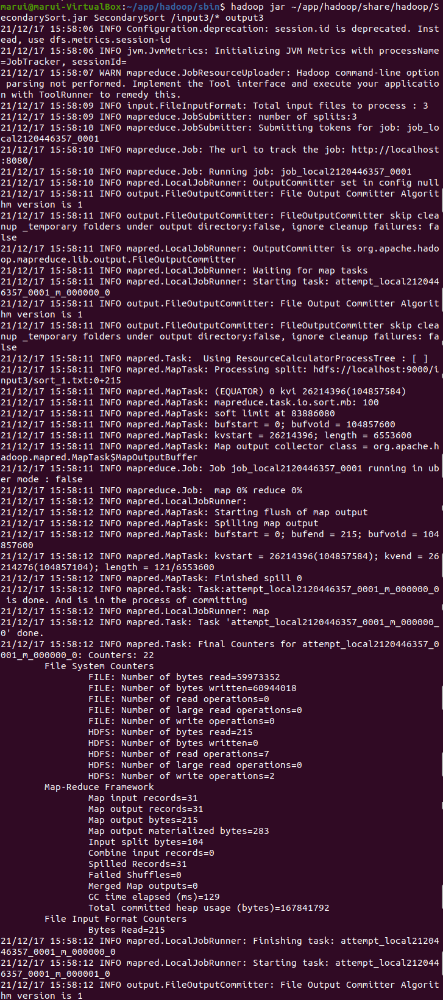

## 查看结果

```SHELL
hdfs dfs -cat output3/part-r-00000
```

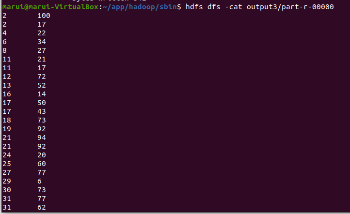

结果正确


# 倒排索引

## 生成文章文件

从网络上摘抄相关文章，并将文章的题目作为文件名。上传至共享文件夹，再移动到`~/articles`。

注意：文件名不能有空格，可以将`_`替换空格

## 上传至hdfs

```shell
hdfs dfs -mkdir /input4
hdfs dfs -put  ~/articles/*.txt  /input4
```

## 实现倒排索引程序

参考：https://www.jianshu.com/p/c12ca6b1d94c

1. Map 过程：首先必须分析输入的key/value对，得到倒排索引中需要的三个信息：单词、文档 URL 和词频。<(单词，URL)，词频>，此过程将词频都设置为1

2. Combine 过程：所有具有相同单词的记录（由单词、 URL 和词频组成）应该交由同一个Reducer 处理，但当前的 key 值无法保证这一点，所以必须修改 key 值和 value 值。这次将单词作为 key 值， URL 和词频组成 value 值（如“ file1.txt： 1”）。这样做的好处是可以利用 MapReduce 框架默认的 HashPartitioner 类完成 Shuffle 过程，将相同单词的所有记录发送给同一个 Reducer 进行处理。

   和`partitioner`的区别：`partitioner`是为了实现负载均衡

3. Reduce 过程：只需将相同 key 值的 value 值组合成倒排索引文件所需的格式即可

```java
import java.io.IOException;
import java.util.StringTokenizer;

import org.apache.hadoop.conf.Configuration;
import org.apache.hadoop.fs.Path;
import org.apache.hadoop.io.Text;
import org.apache.hadoop.mapreduce.Job;
import org.apache.hadoop.mapreduce.Mapper;
import org.apache.hadoop.mapreduce.Reducer;
import org.apache.hadoop.mapreduce.lib.input.FileInputFormat;
import org.apache.hadoop.mapreduce.lib.input.FileSplit;
import org.apache.hadoop.mapreduce.lib.output.FileOutputFormat;

public class InvertedIndex {

    public static class Map extends Mapper<Object, Text, Text, Text> {
        private Text keyInfo = new Text(); // 存储单词和URL组合
        private Text valueInfo = new Text(); // 存储词频
        private FileSplit split; // 存储Split对象
        // 实现map函数
        public void map(Object key, Text value, Context context) throws IOException, InterruptedException {
            // 获得<key,value>对所属的FileSplit对象
            split = (FileSplit) context.getInputSplit();
            StringTokenizer itr = new StringTokenizer(value.toString());
            while (itr.hasMoreTokens()) {
                // key值由单词和URL组成，如 hdfs://localhost:9000/input4/Internet_Scams_Dont_be_a_Victim.txt
                // 获取文件的完整路径，这里为了好看，只获取文件的名称。
                int splitIndex1 = split.getPath().toString().indexOf("input4/");
                int splitIndex2 = split.getPath().toString().indexOf(".txt");
                keyInfo.set(itr.nextToken() + ":" + split.getPath().toString().substring(splitIndex1 + 7, splitIndex2));
                // 词频初始化为1
                valueInfo.set("1");
                context.write(keyInfo, valueInfo);
            }
        }
    }

    public static class Combine extends Reducer<Text, Text, Text, Text> {
        private Text info = new Text();
        // 实现reduce函数
        public void reduce(Text key, Iterable<Text> values, Context context) throws IOException, InterruptedException {
            // 统计词频
            int sum = 0;
            for (Text value : values) {
                sum += Integer.parseInt(value.toString());
            }
            int splitIndex = key.toString().indexOf(":");
            // 重新设置value值由URL和词频组成
            info.set(key.toString().substring(splitIndex + 1) + ":" + sum);
            // 重新设置key值为单词
            key.set(key.toString().substring(0, splitIndex));
            context.write(key, info);
        }
    }

    public static class Reduce extends Reducer<Text, Text, Text, Text> {
        private Text result = new Text();
        // 实现reduce函数
        public void reduce(Text key, Iterable<Text> values, Context context) throws IOException, InterruptedException {
            // 生成文档列表
            StringBuilder fileList = new StringBuilder();
            for (Text value : values) {
                fileList.append(value.toString()).append(";");
            }
            result.set(fileList.toString());
            context.write(key, result);
        }
    }

    public static void main(String[] args) throws Exception {
        Configuration conf = new Configuration();

        Job job = Job.getInstance(conf, "InvertedIndex");

        job.setJarByClass(InvertedIndex.class);

        // 设置Map、Combine和Reduce处理类
        job.setMapperClass(Map.class);
        job.setCombinerClass(Combine.class);
        job.setReducerClass(Reduce.class);

        // 设置Map输出类型
        job.setMapOutputKeyClass(Text.class);
        job.setMapOutputValueClass(Text.class);

        // 设置Reduce输出类型
        job.setOutputKeyClass(Text.class);
        job.setOutputValueClass(Text.class);

        // 设置输入和输出目录
        FileInputFormat.addInputPath(job, new Path(args[0]));
        FileOutputFormat.setOutputPath(job, new Path(args[1]));
        System.exit(job.waitForCompletion(true) ? 0 : 1);
    }
}

```


## 运行倒排索引程序

```shell
hadoop jar ~/app/hadoop/share/hadoop/InvertedIndex.jar InvertedIndex /input4/* output4
```

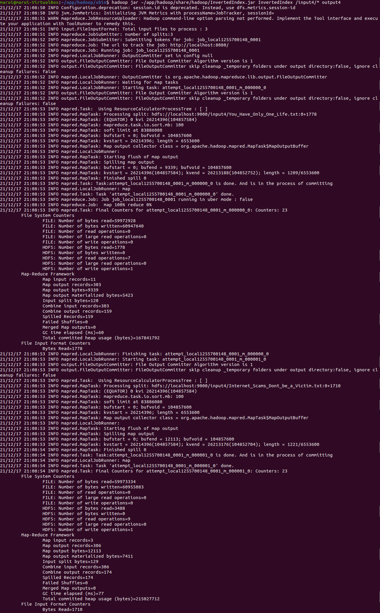

## 查看结果

```SHELL
hdfs dfs -cat output4/part-r-00000
```

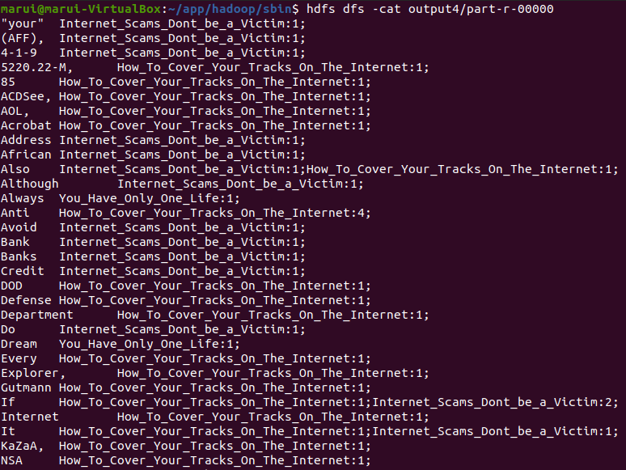

